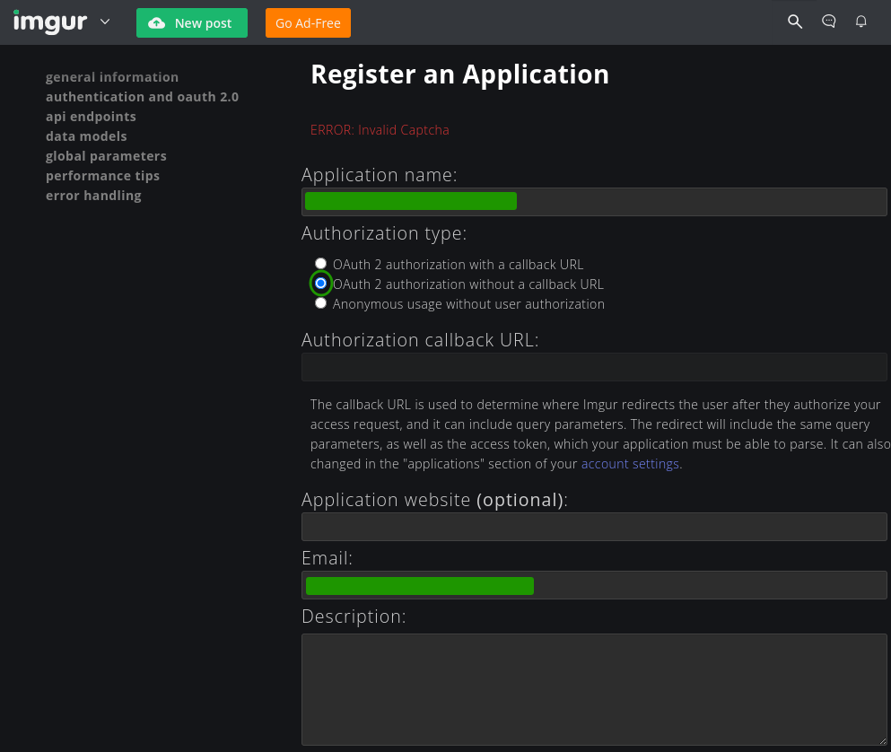
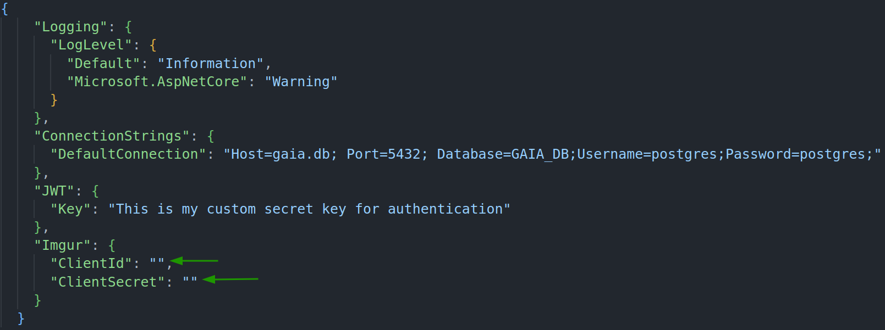

# Projeto Gaia

O Projeto Gaia consiste em uma plataforma de utilidade pública que busca disseminar informações localizadas e conteúdo rico voltado à conscientização sobre maneiras de mitigar possíveis crises climáticas. A plataforma abriga desde conteúdos acadêmicos relacionados ao tema até interações casuais e cotidianas. Nela, o usuário é capaz de interagir de forma similar às redes sociais voltadas ao entretenimento, além de publicar e acessar artigos informativos.

---

    Projeto de submissão para o Hackathon Fernanda KipperDev 2024
    Tecnologia Contra Crises Climáticas: Soluções para Cidades Resilientes

 <a href="#technologies">Tecnologias</a> • 
 <a href="#started">Rodando o projeto</a> •
 <a href="./docs/README.md">Elicitação de requisitos</a>

<h2 id="technologies">💻 Tecnologias</h2>

#### Front-End:

#### Back-End:

#### Devops

<h2 id="started">🚀 Vamos Começar!</h2>

<h3>Pré-Requisitos</h3>

**Para rodar o projeto, é necessário que tenha:**

<h3>Clonando o Projeto</h3>

    git clone https://github.com/Bruno0M/Hackathon-KipperDev2024

<h2>Rodando o Projeto</h2>

**Configure o seu abiente:**

- Navegue para vite-project/ , crie um arquivo ".env" e insira a URL da sua API

      VITE_BASE_URL="http://localhost:1111/" # Por exemplo

- **Para rodar nosso FrontEnd, basta seguir o seguinte:**

      cd Hackathon-KipperDev2024/apps/vite-project/
      pnpm install
      pnpm run dev

#### Com isso, o Front-End estará disponível localmente em http://localhost:5173

---

## E para rodar a Api do Projeto:

#### Configurando o Imgur

Basta entrar nesse link:

[Imgur Auth](https://api.imgur.com/oauth2/addclient)

E após fazer o cadastro a seguir as keys serão disponibilizadas

#### Após obter as Keys, encontre o arquivo appsettings.Development.json

    cd Hackathon-KipperDev2024/apps/Gaia/Gaia.API/appsettings.Development.json

Adicione esse trecho de código depois do “JWT” como mostra a imagem, e depois coloquem as keys em seus lugares correspondentes

#### Após configurar as Keys, vamos iniciar o Docker

    cd Hackathon-KipperDev2024/apps/Gaia/Gaia.API

    docker-compose up -d

ou

    docker compose up -d

#### Em seguida, você vai ter a API Rodando em na porta _1111_, e caso queira ver a documentação da API, basta acessar com o Swagger

    http://localhost:1111/swagger/index.html.

#### A porta 8002 é onde está rodando o banco de dados, e caso queira administrar esse banco, basta acessar o pgadmin4 em:

    http://localhost:16543/login
